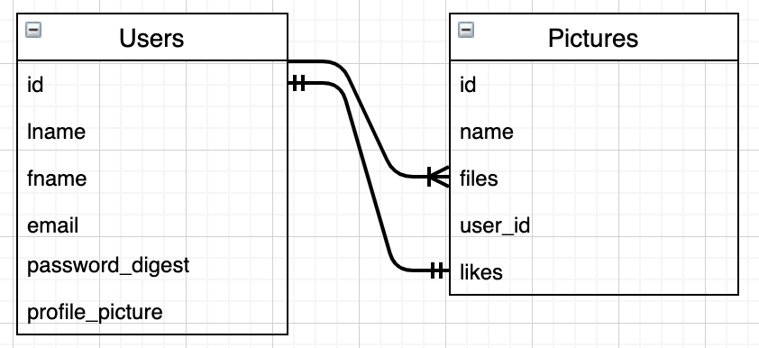

# Instagram Challenge

[Project Description](#project-description) | [Tech Stack](#tech-stack) | [Installation](#installation) | [Running tests](#running-tests) | [Development Process](#development-process) | [User Stories](#user-stories) | [Database](#entity-relationship-diagram) | [Further development](#further-development)

## Project Description

Build Instagram: Simple huh!

Create a clone app of Instagram in Ruby on Rails. This is a solo project focused on deepening knowledge in ruby & Rails, working with DB, focusing on code quality and delivering MPV.

## Tech Stack:

- [Capybara](https://github.com/teamcapybara/capybara) Capybara helps you test web applications by simulating how a real user would interact with your app.
- [RSpec](https://rspec.info/) Behaviour Driven.
  Development for Ruby. **TDD**.
- [Rails](https://rubyonrails.org/) Framework that allows to build modern web apps.
- [Active Record](https://guides.rubyonrails.org/active_record_querying.html) SQL back end data storage.
- [Active Storage](https://edgeguides.rubyonrails.org/active_storage_overview.html) Active Storage facilitates uploading files to a cloud storage service like Amazon S3, Google Cloud Storage, or Microsoft Azure Storage and attaching those files to Active Record objects.
- [Rubocop](https://github.com/rubocop-hq/rubocop) RuboCop is a Ruby static code analyzer (a.k.a. linter) and code formatter.
- [Bootstrap](https://getbootstrap.com/) & CSS for styling.

## Installation

- Clone this repository
  `$ git clone https://github.com/EdAncerys/instagram-challenge`
- Navigate to local repository
  `$ cd instagram-challenge`
- Install bundler if you don't already have it
  `$ gem bundle install`
- Install all dependencies
  `$ bundle install`
- Add/install database structure locally.  
  `$ bin/rails db:create`  
  `$ bin/rails db:create`

## Running tests

- Navigate to local repository
  `$ cd instagram-challenge`
- No need to start the server. In the terminal type the following command:
  `$ rspec`

## How to see it in operation

- Start the server
  `$ rails s`

- Navigate to [http://localhost:3000](http://localhost:3000) in your browser

# Development Process

During development process I used an agile development methodologies of using git, commit messages, git branches, merges and regular code refactor.

## User Stories

```
As a User
So I can create my profile
I want to be able to sign up
```

```
As a User
So I can use my profile
I am able to log in
```

```
As a User
So I can leave my account secure
Im able to log out
```

```
As a User
So I can share my photos
I am able to post a photo
```

```
As a User
So I can see what people post
I am able to see all Users photos posted
```

```
As a User
So I can admire my photo collection
I am able to see my photos listed in one page
```

```
As a User
So I can admire the moment shared
I am able to see a picture in a single page
```

```
As a User
So I can hide embarrassing moments
I can delete the photos
```

```
As a User
So I can share my emotions with others
I am able to give a like
```

```
As a User
So I can express my self in words
I am able to comment on the photos
```

## Entity Relationship Diagram



## Further Development

Ideas to improve our application

- Add feature to share posts across various platforms.
- Improve on UI elements and expand on possibility to implement UI with React.
- User profile page and friend page UI could benefit on added extra features.
